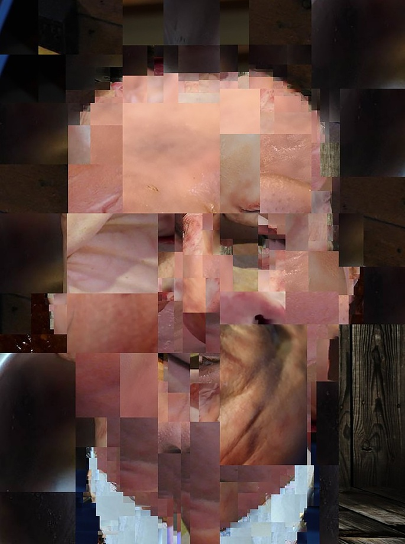

# The Pigs' Ears

Bloody Dave. Sold us all down the river. Twat!

> "You can't make a silk purse from a sow's ear"

Whilst learning Processing I discovered [Tomasz Sulej's watmap project](https://generateme.tumblr.com/) and loved it. You feed it a collection of images to use, and then one image you want to make from the collection. Watmap then very cleverly, looks at the colour and brightness of random rectangles within the image, then finds similar areas within your source images and pieces together a new image. Wondeful.

Lots of StyleGAN images were starting to appear, where images that have *the essence* of another image, and whilst I like some of them, they soon became very tedius, and then became Snapchat filters and done to death.

What I liked about the **Watmap** approach was that:

* The Processing source code was available - and so adaptable
* What it produced had an uncontrollable quality that produced really unusual images.

I then set about attempting to **pigsearsify** the architects of Austerity and Brexit. 

The ones I liked most were when the source image content *almost* overtakes the subject matter, becoming like a *magic eye* picture.

