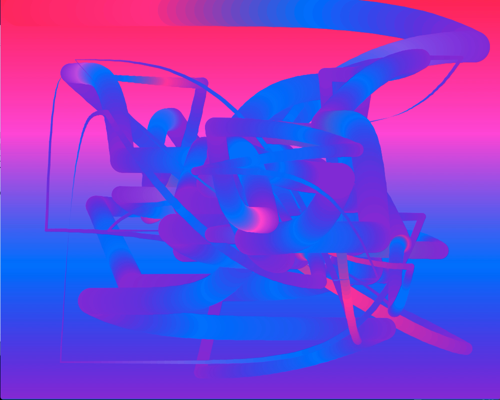

# Wandering Paint Loop

This generative thing starts with a "perfect" gradient and make a random gradient brushstroke. At that point the code analyses the pixels and measures the balance between red  and blue used in the now defaced image, and attempts to "correct" the mess by applying another random brushstroke. 

It stops when it thinks it has restored the "balance" between red and blue, with both at 50%.

[View here](index.html)

