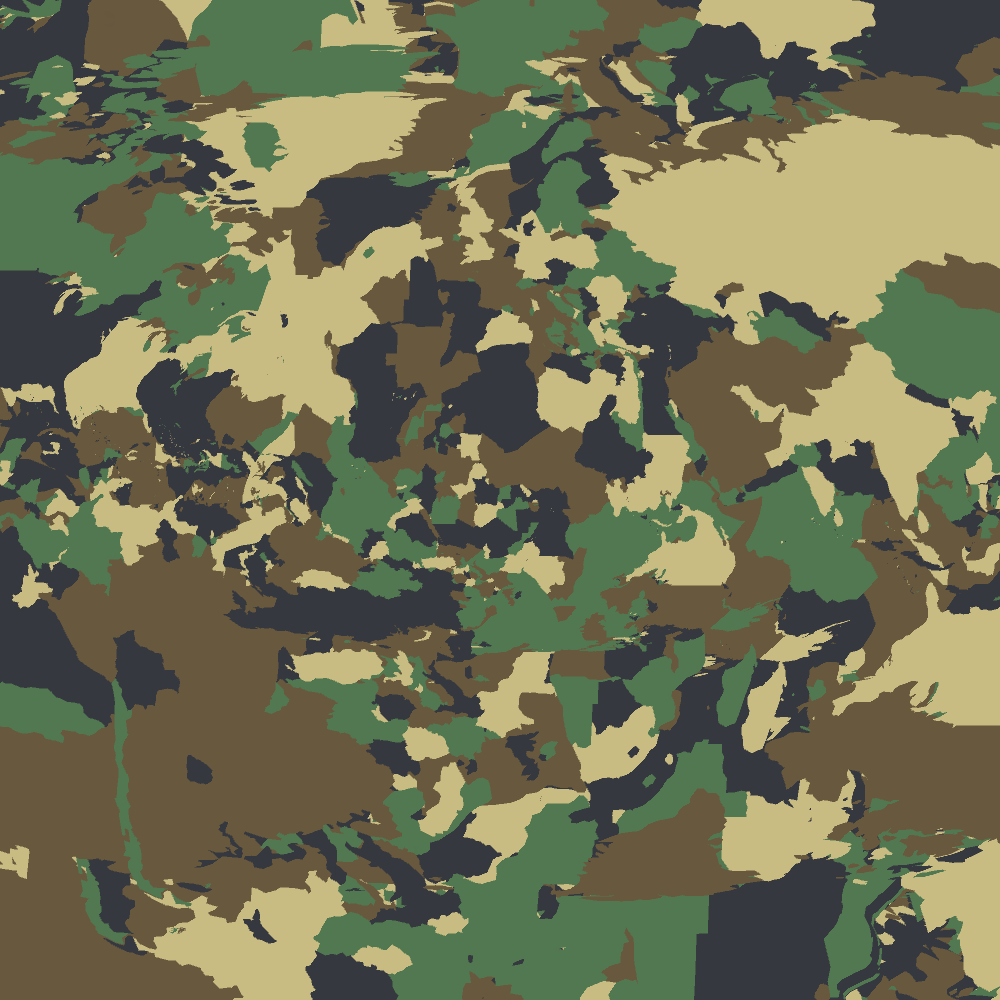
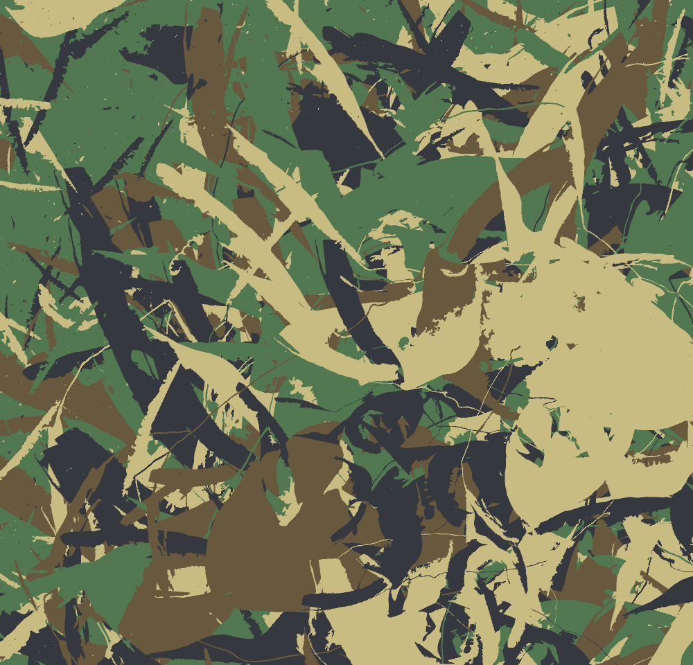

# The World At War

I begun by breaking a world map SVG file down into its separate shapes, or countries, then drew them in camouflage colours.

But then realised I could break down regular images. Here is Priti Patel DESTROYED at random in a similar way.

But then thought these would maybe work better as designs where the pattern *wraps, so that they could be applied like wallpaper to an entire wall.

[World At War I](wrap/index.html)
[World At War II](wrap2/index.html)

